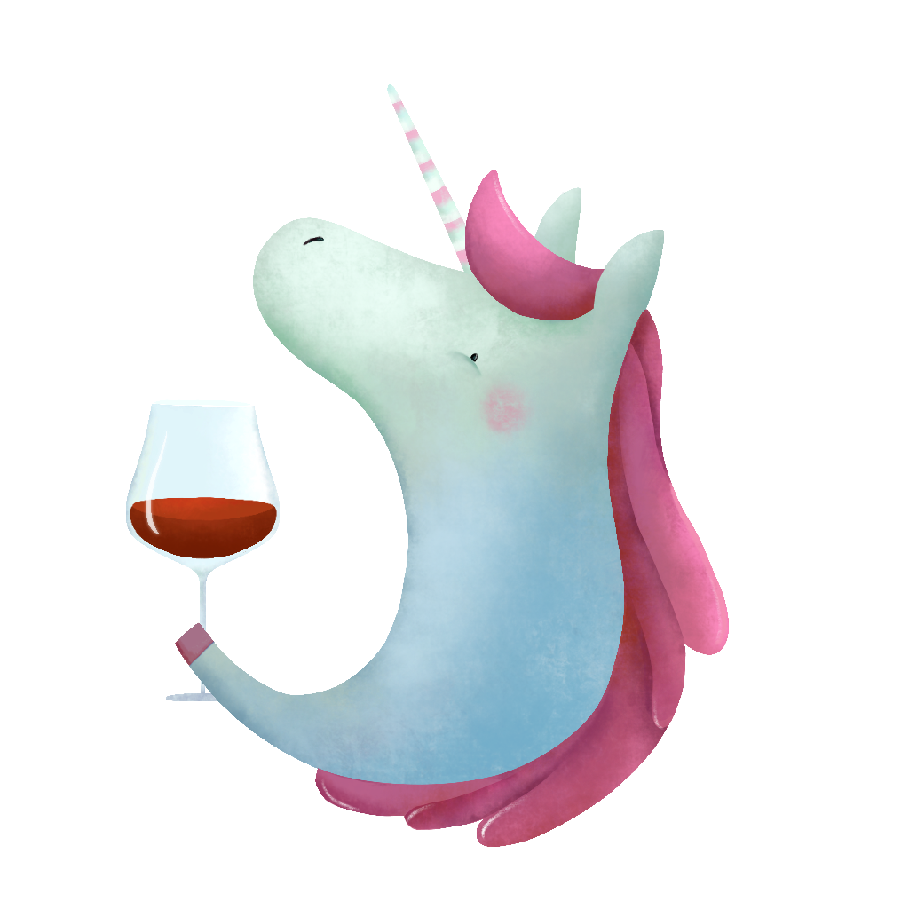

#+OPTIONS: toc:nil

* Vino

#+begin_html

  

<h3 align="center">🍷 It's your cellar, your dear cantina 🍷</h3>

  
  

  

#+end_html

** About Vino

Vino is an advanced Emacs program tailored for managing wine cellars. It boasts a variety of built-in features, including wine rating and cellar tracking, alongside extension points for customisation. Importantly, Vino does not come preloaded with a database of wine-related information such as regions, appellations, grape varieties, producers, or specific wines. This design choice allows for a more personalised experience.

Explore [[https://barberry.io][Barberry Garden]] to see the potential of what can be developed using Vino and its companion, [[https://github.com/d12frosted/vulpea][Vulpea]].

** International Characters

Vino preserves international characters (accents, diacritics) in note titles. A wine or region named "Côtes du Rhône" keeps its proper spelling.

To search using ASCII characters (e.g., typing "Cotes" to find "Côtes"), you have two options:

1. *Completion framework support*: If you use [[https://github.com/oantolin/orderless][orderless]], prefix your search with =%= to enable char-fold matching. For example, =%cotes= matches "Côtes".

2. *Aliases*: Add an ASCII alias to your note. Vino expands aliases during selection, so both spellings become searchable:

   #+begin_example
   :PROPERTIES:
   :ID:       ...
   :ALIASES:  "Cotes du Rhone"
   :END:
   #+title: Côtes du Rhône
   #+end_example

** Picking a Wine

A wine entry is titled after its producer, name and vintage, so a list of them tells you nothing about which one to open. Vino annotates each candidate with colour, country, rating and how many bottles are left:

#+begin_example
Arianna Occhipinti Bombolieri BB 2017 red Italy 4.5 x2
#+end_example

Annotations are part of the candidate string, so they are searchable too: type =Italy= or =rose= to narrow the list. Set =vino-entry-annotate-fn= to your own function to change what is shown, or to nil to turn annotations off.

** Checking Your Cellar

A cellar built over years drifts: a region without a country, a rating without a total, a price that is a typo. The =vino-schema= module describes every vino note type as a [[https://github.com/d12frosted/vulpea][Vulpea]] schema, so you can ask what is broken:

#+begin_src emacs-lisp
(require 'vino-schema)
(vino-schema-setup)
#+end_src

After that the Vulpea validation functions work on wine notes: =vulpea-schema-validate-all= for one schema, =vulpea-schema-note-violations= for the note at hand, =vulpea-schema-collection-health= for the whole collection. With [[https://github.com/d12frosted/vulpea-ui][vulpea-ui]] installed, =vulpea-ui-schema-dashboard= renders the same data.

The schemas follow what =vino-entry-create= writes today, which means two fields are required that older entries may lack: =volume=, which moved to the wine entry in v0.5.0, and =country=, which both origin selection strategies write. Entries created before those changes are reported as incomplete.

Each schema takes its fields from a variable, so you can describe your own metadata without touching the rest:

#+begin_src emacs-lisp
(add-to-list 'vino-schema-entry-fields
             '(:key "drink from" :type number)
             'append)
(vino-schema-setup)
#+end_src

** Installation and Configuration

For installation, our [[https://github.com/d12frosted/vino/wiki][wiki]] provides both concise and comprehensive guides suitable for various methods. It also offers detailed instructions on configuring Vino and organising your notes effectively.

Additionally, the [[https://github.com/d12frosted/vino/wiki][wiki]] includes guidance on how to enhance Vino's functionality, complete with practical examples.

** Acknowledgements

 was created by [[https://www.behance.net/irynarutylo][Iryna Rutylo]].

* Support

If you enjoy this project, you can support its development via [[https://github.com/sponsors/d12frosted][GitHub Sponsors]] or [[https://www.patreon.com/d12frosted][Patreon]].
